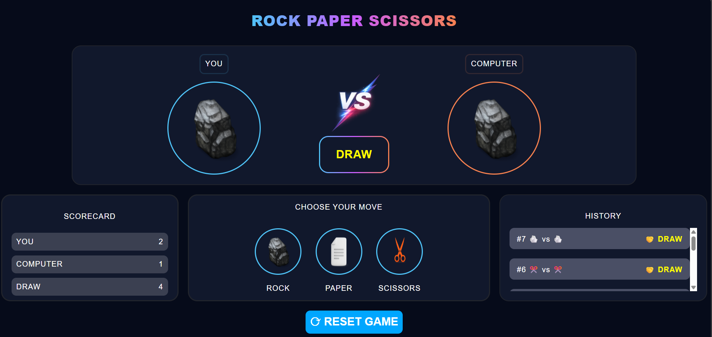

# ✊✋✌️ Rock Paper Scissors

A modern and interactive **Rock Paper Scissors** game built using **HTML, CSS, and JavaScript**. The game features smooth animations, sound effects, a live scoreboard, match history, and an elegant dark-themed UI for an engaging gameplay experience.

---

## 📸 Preview

<p align="center">
  
</p>

---

## 🎥 Demo Video

▶️ https://youtu.be/-OyYt0AAZ4w

---

## ✨ Features

- 🎮 Interactive Rock, Paper, Scissors gameplay
- 🎲 Random computer move generation
- 🎞️ Animated computer shuffle before revealing its move
- 🎯 Animated player move transition
- 🔊 Shuffle sound effect
- 📊 Live Scoreboard
  - Wins
  - Losses
  - Draws
- 📜 Match History with emojis
- 🎨 Color-coded results
  - 🟢 Win
  - 🟠 Lose
  - 🟡 Draw
- 🚫 Prevents multiple clicks while animations are playing
- 🔄 One-click game reset
- 🌙 Modern dark-themed responsive UI

---

## 🛠️ Technologies Used

- HTML5
- CSS3
- JavaScript (ES6)

---

## 🚀 How to Run

1. Clone the repository

```bash
git clone https://github.com/itanuj-thakur/Rock-Paper-Scissors.git
```

2. Open the project folder

```bash
cd Rock-Paper-Scissors
```

3. Open `index.html` in your browser.

---

## 📂 Project Structure

```
Rock-Paper-Scissors/
│
├── preview/
├── images/
├── sound/
├── index.html
├── style.css
├── script.js
└── README.md
```

---

## 🎮 Gameplay

1. Select **Rock**, **Paper**, or **Scissors**.
2. Your choice appears with an animation.
3. The computer shuffles through all moves before revealing its choice.
4. The winner is determined instantly.
5. The scoreboard and history update automatically.
6. Reset the game anytime using the **Reset Game** button.

---

## 📈 Future Improvements

- 🏆 Best of 3 / Best of 5 mode
- 💾 Save scores using Local Storage
- 📱 Improved mobile responsiveness
- 🎉 Confetti animation on victory
- ⌨️ Keyboard shortcuts (R, P, S)
- 📊 Win percentage statistics
- 🌍 Multiplayer mode

---

## 🤝 Contributing

Contributions are welcome!

If you have suggestions or improvements, feel free to fork the repository and submit a pull request.

---

## ⭐ Show your support

If you enjoyed this project, consider giving it a ⭐ on GitHub!